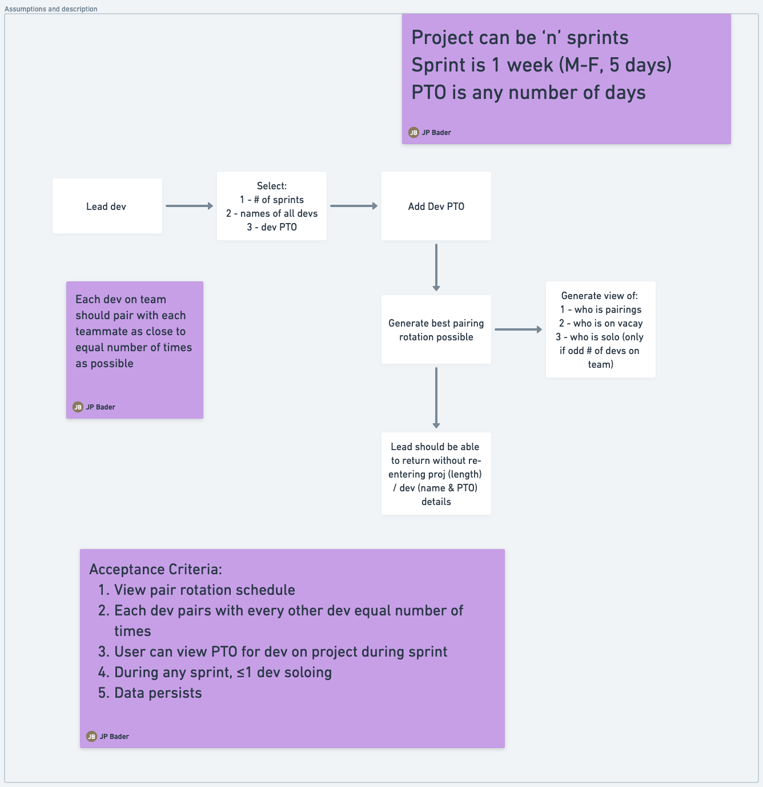
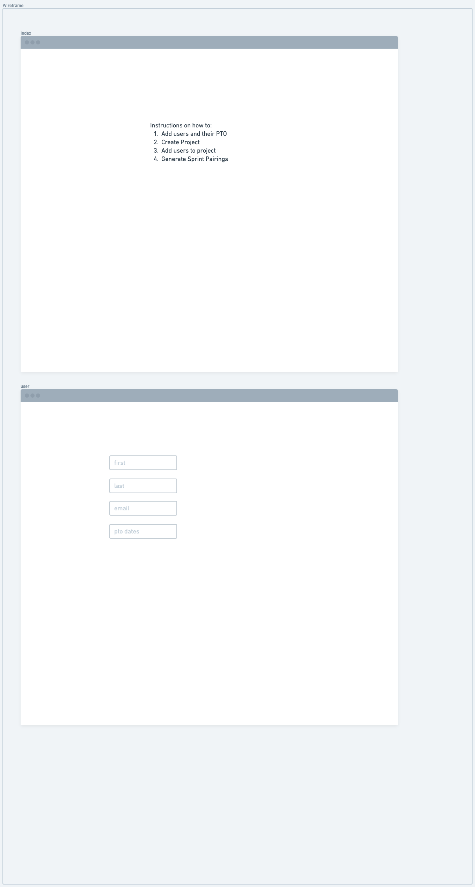
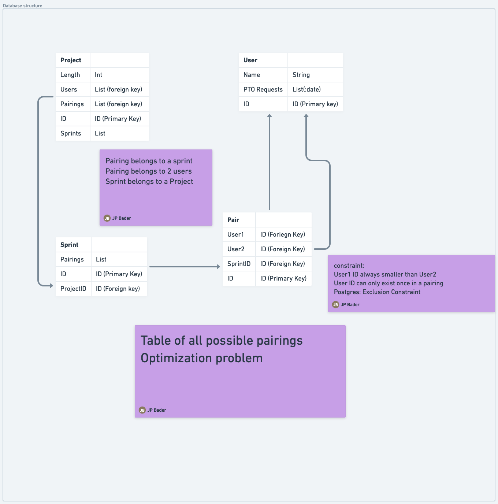

# Pairing

This project is an example project built for as a coding exercise to most efficiently pair programmers together.

The purpose of the project is described here


The workflow diagram created is here (PDF)


The database architecture is here (PDF)


To build this application to work, you must have the following installed: 
1. Elixir (It will auto install the other packages and languages needed, i.e. Erlang, Mix, etc)
2. PostgreSQL (there are a lot of tutorials for this, we won't go into that now)

The easiest way to do this is via Homebrew:
`brew install elixir`

You may need to set the PATH environment variable. More information may be found [here:](https://elixir-lang.org/install.html)

Once installed, verify you're Elixir version with `elixir -v`. You should see something like:
```elixir
Erlang/OTP 25 [erts-13.0.3] [source] [64-bit] [smp:8:8] [ds:8:8:10] [async-threads:1] [jit]

Elixir 1.14.3 (compiled with Erlang/OTP 23)
```

After the main tool is installed, you can clone this repo to any directory. CD into that directory, then you should be able to run this to have the dependencies to run the application:
`mix setup` 

Then run the app with `mix phx.server`


Now you can visit [`localhost:4000`](http://localhost:4000) from your browser.

## Scalability

Per the assignment, Tandem has asked what would my `recommendations be for an easily scalable SaaS product and its accompanying infrastructure`

There are a few things that a scalable SaaS product and it's infrastructure require:
1. For the application architecture, I would recommend keeping the code in a single monolith for as long as possible. If the componentry gets too unwieldy, then it would possibly make sense to split the project into an umbrella application and grow the individual components as apps under the umbrella. This avoids micro-services and can help keep the code in a monorepo.
2. Infrastructure should leverage tools like Terraform in order to have a manageable, replicable state. Utilizing tools like AWS or GCP (or Fly.io), dockerizing your builds, and designing the infrastructure as you want, you can deploy it on a platform of your choosing. Infrastructure as code helps you swap platforms more easily with these tools.
3. It's also important to build for horizontal scalability, enabling the addition of more machines when needed. 
4. Depending on the popularity and size of your SaaS, it may be important to also be database aware, meaning you may need to monitor database performance, and be prepared to scale up or out. 
5. Finally, to ensure you are providing a consistent and robust solution, it's important to maintaint continuous integration, automated testing, and a solid QA process.